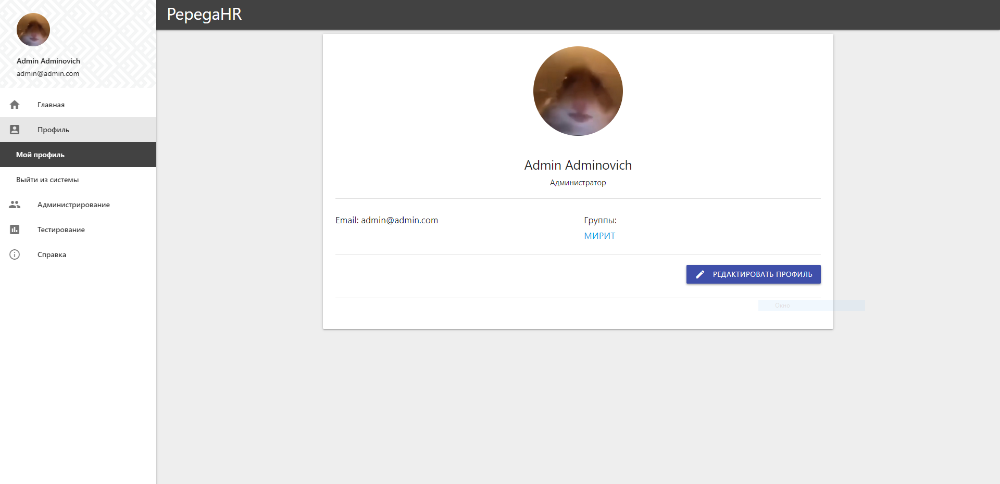
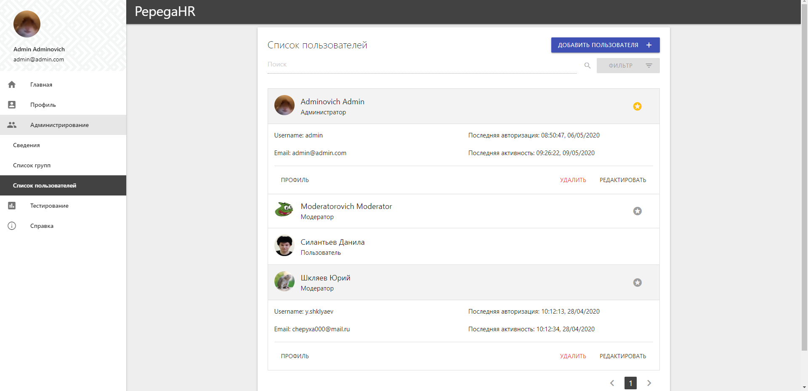
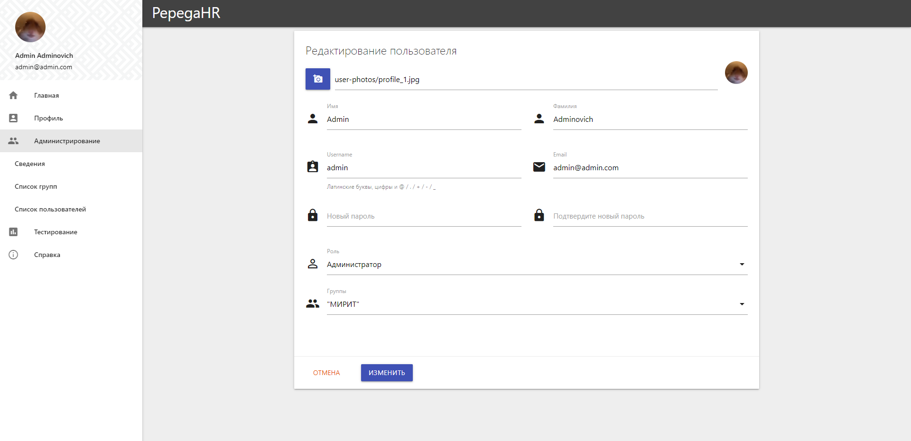
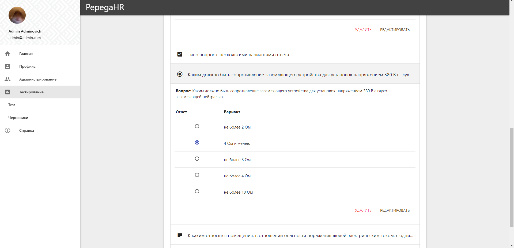

# PepegaHR-WebApplication

### О приложении
PepegaHR-WebApplication - веб-приложение для прохождения тестирования пользователями.

### Особенности
- [X] Создавание пользователей;
- [X] Объяденение пользоватлей в группы;
- [ ] Создание и прохождение тестов;
- [ ] Создание отчетов.

### Установка
1. Virtual Environments (не обязательный шаг)

    a. Создание venv
    ```
    $ python -m venv .\venv         <-- Windows
    $ python -m venv ./venv         <-- Linux  
    ```
    
    b. Активация venv
    ```
    $ venv\Scripts\activate.bat     <-- Windows
    $ source venv/bin/activate      <-- Linux
    ```
2. Установка модулей
```
$ python -m pip install -r requirements.txt        
```

### Запуск
1. Инициализация БД (требуется только перед первым запуском)
```
$ python manage.py makemigrations 
$ python manage.py migrate 
```
    
2. Старт сервера
```
$ python manage.py 127.0.0.1:8000
```
    
### Скриншоты

| Профиль                              |
| ---                                  |
|  | 

| Просмотр пользователей               |
| ---                                  |
|  |

| Редактирование пользователя          |
| ---                                  |
|  |

| Редактирование теста                 |
| ---                                  |
|  |
